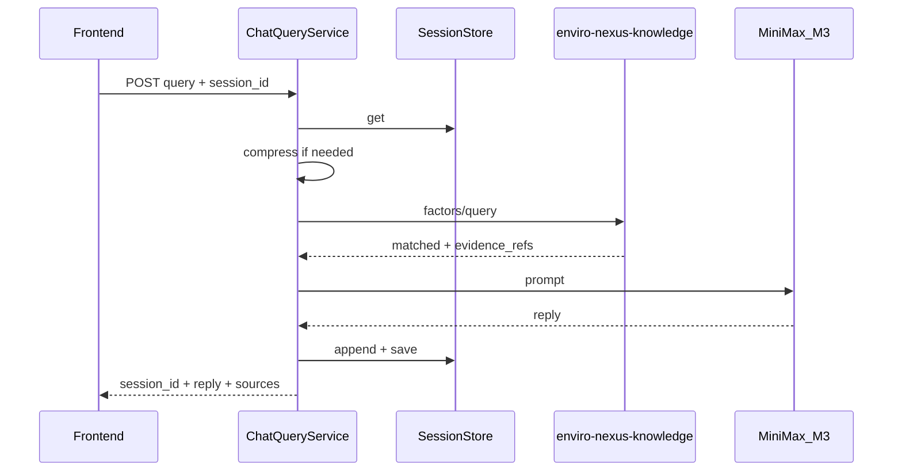

# 会话式因子查询（LangChain + MiniMax-M3）设计说明

**状态**：已评审（brainstorming 五节 + 会话存储说明均已确认）  
**日期**：2026-06-02  
**仓库**：enviro-nexus-api  
**关联**：enviro-nexus-knowledge（检索）、enviro-nexus-web（消费方）

---

## 1. 目标

将现有 `POST /api/v1/factors/query` 升级为**带会话的多轮查询**：

1. 用户提交自然语言 `query`（可选 `session_id`）。
2. API **必调**知识服务检索 MethodCard / evidence。
3. 使用 **LangChain + MiniMax-M3** 基于检索结果生成自然语言 `reply`。
4. 将 **evidence_refs** 作为 `sources` 返回前端（标准名、章节、field_path 等）。
5. 同一会话内保留上下文，并对历史做**摘要缓冲压缩**。

**本阶段不做**：Agent 自主检索、API 侧向量 RAG、LangGraph。

---

## 2. 接口契约

### 2.1 端点

- **路径**：`POST /api/v1/factors/query`（替代原结构化查询语义，不新增平行路径）。
- **保留**：`GET /api/v1/method-cards/{card_id}`、`GET /api/v1/health`。

### 2.2 请求

```json
{
  "query": "COD 怎么测？",
  "session_id": null
}
```

| 字段 | 类型 | 说明 |
|------|------|------|
| `query` | string | 必填，`min_length=1`，`max_length=500` |
| `session_id` | string \| null | 可选；空则服务端生成并在响应返回 |

### 2.3 响应（`ApiResponse` 信封）

```json
{
  "success": true,
  "code": "OK",
  "message": "查询成功",
  "api_version": "v1",
  "request_id": "...",
  "data": {
    "session_id": "uuid",
    "matched": true,
    "reply": "自然语言回答（面向检测人员）",
    "factor": "化学需氧量",
    "card_id": "water_cod_hj828_2017",
    "sources": [
      {
        "evidence_id": "ev_001",
        "source_title": "HJ 828-2017",
        "section": "适用范围",
        "summary": "...",
        "field_path": "applicability.scope_summary"
      }
    ],
    "warnings": []
  },
  "error": null,
  "timestamp": "2026-06-02 17:14:09"
}
```

| 字段 | 说明 |
|------|------|
| `reply` | MiniMax 生成；须基于本轮 knowledge 检索块与会话摘要 |
| `sources` | **100% 来自** knowledge `evidence_refs`，模型不得单独虚构出处列表 |
| `session_id` | 每轮响应必返；客户端后续请求原样携带 |

### 2.4 未命中

- HTTP **200**，`success=true`，`code=FACTOR_NOT_FOUND`。
- `matched=false`，`reply` 说明未收录，`sources=[]`。
- 会话仍追加一轮（user + assistant）。

### 2.5 破坏性变更

原 `data.answer` 结构化大字段移除；前端需改为展示 `reply` + `sources`。同步更新 enviro-nexus-web 与 poc 文档示例。

---

## 3. 架构与数据流

### 3.1 固定流水线（方案 B：非 Agent）

每轮请求顺序：

1. 解析 `session_id`（空则生成 UUID）。
2. `SessionStore.get` → `summary` + `messages`。
3. `ContextCompressor`：超阈值则摘要旧消息并写回 Store。
4. `KnowledgeClient.query_factor(query)` → matched / answer / evidence_refs。
5. 组装 Prompt → LangChain `ChatOpenAI`（MiniMax-M3）→ `reply`。
6. `SessionStore.append` user + assistant，`save`。
7. 返回 `ApiResponse`。

知识服务**无状态**，不参与会话。

### 3.2 模块

| 模块 | 路径（建议） | 职责 |
|------|----------------|------|
| 路由 | `app/api/v1/factors.py` | 参数校验、调 `ChatQueryService` |
| 编排 | `app/services/chat_query_service.py` | 上述 7 步 |
| 会话 | `app/services/session_store.py` | 抽象 + Memory / Redis |
| 压缩 | `app/services/context_compressor.py` | 摘要缓冲 |
| 检索 | `app/clients/knowledge_client.py` | 不变 |
| LLM | `app/llm/minimax_chat.py` | `get_chat_model()` |
| Schema | `app/schemas/chat_query.py` | 请求/响应模型 |

### 3.3 示意图



---

## 4. 会话管理

### 4.1 控制方

**enviro-nexus-api** 全权管理会话；前端只保存并回传 `session_id`。

| 行为 | 规则 |
|------|------|
| 新会话 | 无 `session_id` → 生成 UUID，响应返回 |
| 续聊 | 携带已有 `session_id` → 加载同一条记录 |
| 过期/未知 id | **懒创建**新会话 + 新 UUID，`warnings` 可提示「会话已过期」 |

### 4.2 数据写到哪里

| 配置 | 实现 | 适用 |
|------|------|------|
| `SESSION_STORE=memory` | 进程内 `dict` + TTL | POC / 单机（重启丢失） |
| `SESSION_STORE=redis` | `session:{id}` JSON + TTL | 联调 / 多实例 |

**不写入**：PostgreSQL、文件、knowledge、MiniMax 持久化存储。

### 4.3 会话文档结构

```json
{
  "session_id": "uuid",
  "created_at": "2026-06-02 17:00:00",
  "updated_at": "2026-06-02 17:05:00",
  "summary": "用户曾询问 COD 测定与样品保存。",
  "messages": [
    {"role": "user", "content": "..."},
    {"role": "assistant", "content": "..."}
  ]
}
```

### 4.4 上下文压缩（摘要缓冲）

| 参数 | 默认 | 说明 |
|------|------|------|
| `MAX_RECENT_TURNS` | 6 | 保留最近 6 条消息完整原文 |
| `COMPRESS_TOKEN_THRESHOLD` | 模型上下文约 60% | 超过则触发压缩 |
| 摘要 | 同 MiniMax-M3，`temperature=0` | 只归纳历史，不编造标准 |

流程：将「除最近 N 条外」的 `messages` 送入摘要 Prompt → 合并进 `summary` → 删除已摘要的 `messages`。

Prompt 顺序：`系统提示` → `【会话摘要】` → `【最近对话】` → `【本轮检索块】` → `【用户问题】`。

### 4.5 TTL

- `SESSION_TTL_SECONDS` 默认 `86400`（24h）。
- 过期后 `get` 为空 → 懒创建新会话。

---

## 5. LLM 与防幻觉

### 5.1 MiniMax 接入

默认 **OpenAI 兼容** Chat Completions：

- `langchain-openai` → `ChatOpenAI`
- `openai_api_key` = `MINIMAX_API_KEY`
- `openai_api_base` = `MINIMAX_BASE_URL`
- `model` = `MINIMAX_MODEL`（默认 `MiniMax-M3`）

若非兼容接口，仅替换 `app/llm/minimax_chat.py`，编排层不变。

### 5.2 LangChain 范围

| 使用 | 不使用 |
|------|--------|
| ChatPrompt + ChatOpenAI（reply） | Agent / Tools 自主检索 |
| 独立摘要 Prompt（压缩） | LangGraph、向量库 |

### 5.3 系统提示要点

- 仅依据本轮检索块 + 会话摘要作答。
- `matched=false` 时不给标准号/方法细节。
- 简体中文；引用由 API `sources` 提供，不在正文伪造出处。

### 5.4 本轮检索块（模板注入）

包含：`matched`、`factor`、`card_id`、标准代号/名称、方法、适用范围、关键要求摘要、`evidence_refs` 列表。

---

## 6. 错误处理

| 场景 | HTTP | code | 会话 |
|------|------|------|------|
| 参数校验失败 | 422 | `VALIDATION_ERROR` | 不写 |
| knowledge 失败 | 502 | `KNOWLEDGE_SERVICE_ERROR` | 不写 |
| MiniMax 失败 | 502 | `LLM_SERVICE_ERROR` | 整轮不落库 |
| 未命中知识库 | 200 | `FACTOR_NOT_FOUND` | 正常追加 |
| session 过期 | 200 | `OK` + warning | 新 session_id |

统一走 `build_error_response`。

---

## 7. 配置项

```bash
# MiniMax
MINIMAX_API_KEY=
MINIMAX_BASE_URL=https://api.minimax.chat/v1
MINIMAX_MODEL=MiniMax-M3
MINIMAX_TIMEOUT=60

# Session
SESSION_STORE=memory
REDIS_URL=redis://localhost:6379/0
SESSION_TTL_SECONDS=86400
MAX_RECENT_TURNS=6

# 既有
KNOWLEDGE_SERVICE_BASE_URL=http://127.0.0.1:8010/api/v1
KNOWLEDGE_SERVICE_TIMEOUT=10.0
```

---

## 8. 测试

| 层级 | 范围 |
|------|------|
| 单元 | `ContextCompressor`、`InMemorySessionStore` TTL |
| 集成 | mock knowledge + mock LLM：`sources` 一致性、`session_id`、多轮 prompt 含历史 |
| 集成 | knowledge 超时 → 502，无会话写入 |
| 回归 | 更新 `test_factors.py` 为新响应形状；`test_health` 不变 |

不依赖真实 MiniMax / 生产 Redis（Redis 可 fakeredis 或仅接口单测）。

---

## 9. 依赖

```toml
langchain-core>=0.3
langchain-openai>=0.2
redis>=5.0   # SESSION_STORE=redis 时使用
```

---

## 10. 实施顺序

1. Schema + 路由（新 request/response）
2. `SessionStore`（memory）+ `ContextCompressor`
3. `ChatQueryService`（mock LLM）
4. MiniMax 实连 + `.env.example`
5. `RedisSessionStore`（可选）
6. 测试 + README / poc 示例更新

---

## 11. 决策记录

| 决策 | 选择 |
|------|------|
| 接口形态 | 替代 `/factors/query`，不保留旧结构化 answer |
| 检索 | 仅 knowledge 服务 |
| 引用位置 | MethodCard `evidence_refs` |
| 会话 id | 首次自动生成 |
| 压缩 | 摘要缓冲 + 最近 N 轮原文 |
| 存储 | memory（默认）/ redis（配置） |
| 编排 | 固定流水线，非 Agent |
