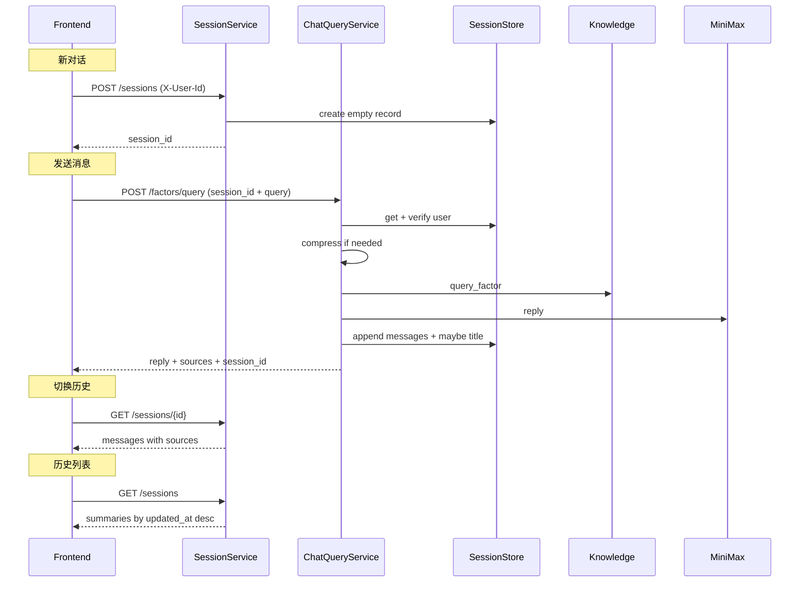

# 多轮会话管理 API 设计说明

**状态**：已评审（brainstorming + implementation plan 已确认）  
**日期**：2026-06-03  
**仓库**：enviro-nexus-api  
**关联**：enviro-nexus-knowledge（检索）、enviro-nexus-web（消费方）  
**前置**：[`2026-06-02-chat-query-minimax-design.md`](2026-06-02-chat-query-minimax-design.md)

---

## 1. 目标

在现有会话式因子查询基础上，为前端多轮对话 UI 提供**完整的后端会话管理能力**：

1. 用户通过 `X-User-Id` 归属会话，不同用户、不同会话上下文相互隔离。
2. 显式创建空会话（「新对话」），在指定会话内多轮追问。
3. 列出历史会话、打开会话恢复完整消息（含 assistant 的 `sources`）。
4. 用户主动删除会话；会话**无 TTL**，持久保留直至删除。
5. 上下文过长时沿用现有 `ContextCompressor` 摘要压缩策略。
6. 空输入拦截并给出提示。

**本阶段不做**：完整用户认证（JWT/OAuth）、PostgreSQL 持久化、会话重命名 PATCH、批量删除。

---

## 2. 已确认决策

| 项 | 选择 |
|----|------|
| 用户归属 | 请求头 `X-User-Id`（POC / 内网） |
| 生命周期 | 无 TTL，仅 `DELETE` 清理 |
| 存储 | 扩展现有 Memory/Redis，去掉过期逻辑 |
| 列表标题 | 首轮 AI 回复后，摘要模型生成短标题（≤20 字） |
| 消息结构 | assistant 消息持久化 `sources` |
| 会话操作 | 显式 `POST /sessions` + `DELETE` |
| 架构 | **方案 A**：`SessionService` + `ChatQueryService` 分层 |

---

## 3. 架构

### 3.1 模块职责

| 模块 | 路径 | 职责 |
|------|------|------|
| 路由（会话） | `app/api/v1/sessions.py` | 创建 / 列表 / 详情 / 删除 |
| 路由（查询） | `app/api/v1/factors.py` | 在已有会话内发消息（改造） |
| 会话编排 | `app/services/session_service.py` | CRUD、标题生成、用户校验 |
| 查询编排 | `app/services/chat_query_service.py` | 知识检索 + LLM 回复 + 落库 |
| 存储 | `app/services/session_store.py` | 扩展 list / delete / 用户索引 |
| 压缩 | `app/services/context_compressor.py` | 不变 |
| Schema | `app/schemas/session.py`、`app/schemas/chat_query.py` | 扩展模型 |
| 依赖 | `app/dependencies.py` | `X-User-Id` 提取、`SessionService` 注入 |

### 3.2 数据流



### 3.3 典型前端流程

1. **新对话**：`POST /sessions` → 获得 `session_id` → 用户输入 → `POST /factors/query`。
2. **追问**：同一 `session_id` 反复调用 `POST /factors/query`。
3. **历史列表**：`GET /sessions` 展示侧边栏。
4. **打开历史**：`GET /sessions/{id}` 恢复消息列表。
5. **删除**：`DELETE /sessions/{id}`。
6. **再开新对话**：重复步骤 1。

---

## 4. 数据模型

### 4.1 SessionRecord（扩展）

```json
{
  "session_id": "uuid",
  "user_id": "user-001",
  "title": "COD 测定方法咨询",
  "created_at": "2026-06-03T10:00:00Z",
  "updated_at": "2026-06-03T10:05:00Z",
  "summary": "用户曾询问 COD 测定与样品保存。",
  "messages": [
    {"role": "user", "content": "COD 怎么测？", "sources": []},
    {
      "role": "assistant",
      "content": "化学需氧量（COD）通常采用...",
      "sources": [
        {
          "evidence_id": "ev_001",
          "source_title": "HJ 828-2017",
          "section": "适用范围",
          "summary": "...",
          "field_path": "applicability.scope_summary"
        }
      ]
    }
  ]
}
```

| 字段 | 说明 |
|------|------|
| `user_id` | 来自 `X-User-Id`，创建时写入，不可变 |
| `title` | 创建时为空；首轮 query 完成后由摘要模型生成 |
| `summary` | 上下文压缩产物，逻辑不变 |
| `messages` | 按时间顺序；user 的 `sources` 恒为空列表 |

### 4.2 SessionSummary（列表项）

```json
{
  "session_id": "uuid",
  "title": "COD 测定方法咨询",
  "created_at": "2026-06-03T10:00:00Z",
  "updated_at": "2026-06-03T10:05:00Z",
  "preview": "化学需氧量（COD）通常采用...",
  "message_count": 4
}
```

- `preview`：最后一条消息 `content` 截断（默认 80 字符，超出加 `…`）。
- `message_count`：`messages` 长度。

### 4.3 ChatMessage（扩展）

```python
role: str           # "user" | "assistant"
content: str
sources: list[SourceItem] = []   # 复用 chat_query.SourceItem；仅 assistant 有值
```

---

## 5. API 契约

### 5.1 公共约定

- **请求头**：`X-User-Id: string`（必填，所有会话相关端点及 `POST /factors/query`）。
- **缺失** → HTTP 422，`code=VALIDATION_ERROR`，`message` 提示缺少用户标识。
- **响应信封**：沿用 `ApiResponse[T]`。
- **路由前缀**：`/api/v1`。

### 5.2 `POST /api/v1/sessions`

创建空会话（「新对话」）。

**响应 `data`**：

```json
{
  "session_id": "uuid",
  "title": "",
  "created_at": "...",
  "updated_at": "...",
  "messages": []
}
```

### 5.3 `GET /api/v1/sessions`

当前用户的历史会话列表，按 `updated_at` **降序**。

**查询参数**：

| 参数 | 默认 | 说明 |
|------|------|------|
| `page` | 1 | 页码，≥1 |
| `page_size` | 20 | 每页条数，1–100 |

**响应 `data`**：

```json
{
  "items": [ /* SessionSummary[] */ ],
  "total": 42,
  "page": 1,
  "page_size": 20
}
```

### 5.4 `GET /api/v1/sessions/{session_id}`

返回完整 `SessionRecord`（含全部 `messages` 与 `sources`）。

- 会话不存在或不属于当前用户 → HTTP 404，`code=SESSION_NOT_FOUND`（不区分原因，避免信息泄露）。

### 5.5 `DELETE /api/v1/sessions/{session_id}`

删除会话及其索引。

- 成功 → HTTP 200，`data={"deleted": true}`。
- 不存在或不属于当前用户 → HTTP 404，`code=SESSION_NOT_FOUND`。

### 5.6 `POST /api/v1/factors/query`（改造）

**请求**：

```json
{
  "query": "那样品怎么保存？",
  "session_id": "uuid"
}
```

| 字段 | 变更 |
|------|------|
| `session_id` | **必填**（原为可选） |
| `query` | 必填；`strip()` 后为空 → 422，提示「请输入问题内容」 |

**行为变更**：

| 行为 | 新规则 |
|------|--------|
| 会话解析 | 必须存在且 `user_id` 匹配 `X-User-Id` |
| 无效 session | 404 `SESSION_NOT_FOUND`，**不再懒创建** |
| 落库 | user 消息 + assistant 消息（含 `sources`） |
| 标题 | 若 `title` 为空且本轮为首次完整往返（追加后共 2 条消息），同步调摘要模型生成标题 |
| `warnings` | 移除 `SESSION_EXPIRED_WARNING` |

**响应 `data`**：形状不变（`session_id`、`reply`、`sources`、`matched` 等）。

### 5.7 标题生成 Prompt 要点

- 输入：首轮 user 消息 + 首轮 assistant 回复。
- 输出：简体中文短标题，≤20 字，不含引号。
- 模型：与 `ContextCompressor` 相同 summarizer（MiniMax，`temperature=0`）。
- 失败：记录 warning 日志，`title` 回退为首条 user 消息截断（30 字）。

---

## 6. 存储层

### 6.1 SessionStore 接口扩展

```python
async def create(self, record: SessionRecord) -> None: ...
async def get(self, session_id: str) -> SessionRecord | None: ...
async def save(self, record: SessionRecord) -> None: ...
async def delete(self, session_id: str) -> bool: ...
async def list_by_user(
    self, user_id: str, offset: int, limit: int
) -> tuple[list[SessionRecord], int]: ...
```

### 6.2 InMemorySessionStore

- **移除** `_is_expired` 及 TTL 相关逻辑。
- `_data: dict[str, SessionRecord]` 存会话主体。
- `_user_index: dict[str, list[str]]` 存每用户的 `session_id` 列表；`save` / `create` 时按 `updated_at` 降序维护；`delete` 时同步移除。

### 6.3 RedisSessionStore

- `SET session:{id}` 存 JSON，**不设** `ex`。
- `ZADD user:{user_id}:sessions {updated_at_unix} {session_id}` 维护列表索引。
- `list_by_user`：`ZREVRANGE` + 批量 `GET`。
- `delete`：`DEL session:{id}` + `ZREM user:{user_id}:sessions {session_id}`。

### 6.4 限制说明（方案 D 固有风险）

- Memory：进程重启丢失；多实例不共享。
- Redis：无 TTL 时需运维关注容量；重启策略依赖 Redis 持久化配置。
- 生产环境后续可迁移 PostgreSQL，接口层不变。

---

## 7. 服务层

### 7.1 SessionService

| 方法 | 说明 |
|------|------|
| `create_session(user_id)` | 生成 UUID，写入空 `SessionRecord`，返回详情 |
| `list_sessions(user_id, page, page_size)` | 分页列表，映射为 `SessionSummary` |
| `get_session(user_id, session_id)` | 校验归属，返回完整记录；否则抛 `SessionNotFoundError` |
| `delete_session(user_id, session_id)` | 校验归属后删除 |

### 7.2 ChatQueryService 改造

- 构造函数增加对 `SessionService` 或 Store 的用户校验能力（推荐通过 Store + 内联校验，避免循环依赖）。
- `query(query, session_id, user_id, request_id)`：
  1. 加载会话，校验 `user_id`。
  2. `ContextCompressor.maybe_compress`。
  3. 知识检索 + LLM 回复（逻辑不变）。
  4. 追加 messages（assistant 含 `sources`）。
  5. 若需生成标题，调用 summarizer。
  6. `save` 并更新用户索引中的排序。

### 7.3 依赖注入

- `get_user_id(request)`：从 `X-User-Id` 提取，缺失抛 422。
- `get_session_service_dep`、`get_chat_query_service_dep` 注册到 `dependencies.py`。
- `v1_router` 注册 `sessions.router`。

---

## 8. 错误处理

| 场景 | HTTP | code | 会话写入 |
|------|------|------|----------|
| 缺少 `X-User-Id` | 422 | `VALIDATION_ERROR` | 否 |
| 空/纯空白 `query` | 422 | `VALIDATION_ERROR` | 否 |
| session 不存在 / 越权 | 404 | `SESSION_NOT_FOUND` | 否 |
| knowledge 失败 | 502 | `KNOWLEDGE_SERVICE_ERROR` | 否 |
| LLM 失败 | 502 | `LLM_SERVICE_ERROR` | 否 |
| 未命中知识库 | 200 | `FACTOR_NOT_FOUND` | 是（含 sources=[]） |
| 标题生成失败 | 200 | `OK` | 是（title 回退截断） |

新增异常类：`SessionNotFoundError` → 404 处理器注册。

---

## 9. 配置项变更

| 变量 | 变更 |
|------|------|
| `SESSION_TTL_SECONDS` | **废弃**（保留字段兼容 .env，文档标注 ignored） |
| `MAX_RECENT_TURNS` | 不变 |
| `SESSION_STORE` | 不变（memory / redis） |

---

## 10. 破坏性变更（相对 2026-06-02 spec）

1. `POST /factors/query` 的 `session_id` 改为**必填**。
2. 所有会话相关请求需 `X-User-Id`。
3. 移除 query 时的会话懒创建与 `SESSION_EXPIRED_WARNING`。
4. 前端须先 `POST /sessions` 再发首条消息。
5. enviro-nexus-web 需同步改造。

---

## 11. 测试

| 层级 | 范围 |
|------|------|
| SessionStore | create / list_by_user 排序 / delete / 无 TTL / Redis 索引（mock 或 fakeredis） |
| SessionService | CRUD、404 越权、preview 截断 |
| ChatQueryService | 必填 session、sources 落库、首轮 title 生成与回退 |
| API | sessions 四端点、`X-User-Id` 422、空 query 422、query 404 |
| 回归 | 更新 `test_factors.py`、`test_chat_query_service.py`、`test_context_compressor.py` |

---

## 12. 实施顺序

1. Schema 扩展（`SessionRecord`、`ChatMessage`、`SessionSummary`、sessions 响应模型）
2. `SessionStore` 扩展 + 去 TTL
3. `SessionService` + `sessions.py` 路由
4. `ChatQueryService` 改造 + `factors.py` 接入 `X-User-Id`
5. 标题生成 Prompt（`app/llm/prompts.py`）
6. 异常与 OpenAPI 更新
7. 测试 + README / 前端联调说明

---

## 13. 决策记录

| 决策 | 选择 |
|------|------|
| 架构 | 方案 A：`SessionService` + `ChatQueryService` |
| 用户标识 | `X-User-Id` 请求头 |
| 持久化 | Memory/Redis 无 TTL |
| 标题 | 首轮完成后 LLM 生成，失败回退截断 |
| sources | assistant 消息持久化 |
| 新对话 | 显式 `POST /sessions` |
| 会话删除 | `DELETE /sessions/{id}` |
| 越权访问 | 统一 404 |
