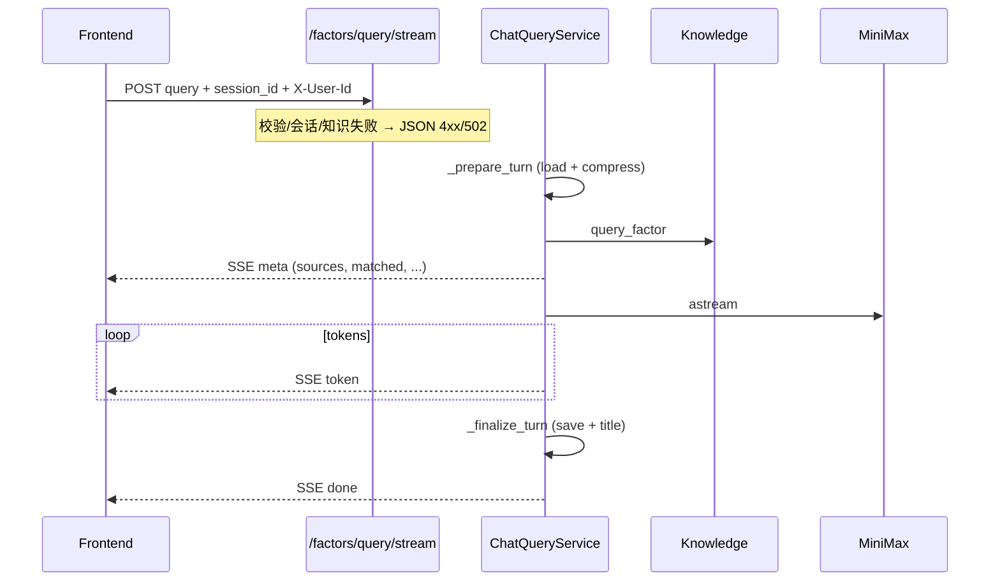

# 流式因子查询 API 设计说明

**状态**：已评审（brainstorming + implementation plan 已确认）  
**日期**：2026-06-03  
**仓库**：enviro-nexus-api  
**关联**：enviro-nexus-knowledge（检索）、enviro-nexus-web（消费方）  
**前置**：[`2026-06-03-multi-turn-session-design.md`](2026-06-03-multi-turn-session-design.md)

**后续契约更新**：当前实现以 enviro-nexus-knowledge 真实契约为准，请求体只要求 `query` 与 `session_id`。`factor_name` 仅作为历史兼容字段被忽略，不再透传给 knowledge。

---

## 1. 目标

在**不修改**现有 `POST /api/v1/factors/query` 接口的前提下，新增流式输出端点，使前端能够逐字展示 AI 回复。

1. 新增 SSE 流式接口，请求体与鉴权规则与现有 query 完全一致。
2. 知识检索完成后立即推送 `sources` 等元数据，LLM 回复逐 token 推送。
3. 流前错误沿用 JSON `ApiResponse` 信封；流中 LLM 失败推送 `error` 事件且不落库。
4. 通过方案 A（共通 prep + 双入口）重构 `ChatQueryService` 内部，最大化复用现有逻辑。

**本阶段不做**：修改现有 `/factors/query` 路由或响应、流式化知识检索、流式化标题生成、OpenAI 兼容 delta 格式。

---

## 2. 已确认决策

| 项 | 选择 |
|----|------|
| 流式协议 | SSE（`text/event-stream`） |
| 元数据时机 | 知识检索完成后先发 `meta`，再流 `token`，最后 `done` |
| 流前错误 | JSON 响应（422 / 404 / 502），不开启 SSE |
| 流中 LLM 失败 | 推 `error` 事件后关闭连接，**不落库**本轮消息 |
| 架构 | **方案 1**：抽取共通 prep + 双入口（`query` / `query_stream`） |
| 现有接口 | **零改动** |

---

## 3. 架构

### 3.1 端点

| 端点 | 方法 | 响应 |
|------|------|------|
| `/api/v1/factors/query` | POST | JSON `ApiResponse[FactorQueryData]`（不变） |
| `/api/v1/factors/query/stream` | POST | SSE `text/event-stream`（新增） |

### 3.2 请求（与现有完全一致）

**请求头**：`X-User-Id`（必填）

**请求体**：

```json
{
  "query": "COD 怎么测？",
  "session_id": "uuid"
}
```

校验规则同 `FactorQueryRequest`：`query` strip 后非空、`session_id` 必填。

### 3.3 模块职责

| 模块 | 变更 |
|------|------|
| `app/services/chat_query_service.py` | 抽取 `_prepare_turn` / `_finalize_turn` 等共通方法；新增 `query_stream()` |
| `app/api/v1/factors.py` | 新增 `query_factor_stream` 路由 |
| `app/schemas/chat_query.py` | 可选：SSE 事件 payload 模型（文档与测试用） |
| `app/services/chat_query_service.py` 内 | 新增内部 `TurnContext` dataclass |

### 3.4 数据流



---

## 4. SSE 事件契约

### 4.1 通用格式

```
event: {type}
data: {json}

```

- `Content-Type: text/event-stream`
- 每个事件以空行 `\n\n` 结束
- `data` 为单行 JSON 字符串
- 响应头建议：`Cache-Control: no-cache`、`X-Accel-Buffering: no`（防 nginx 缓冲）

### 4.2 `meta`（知识检索完成后、LLM 开始前）

```json
{
  "session_id": "uuid",
  "matched": true,
  "factor": "化学需氧量",
  "matched_alias": "COD",
  "card_id": "water_cod_hj828_2017",
  "sources": [
    {
      "evidence_id": "ev_001",
      "source_title": "HJ 828-2017",
      "section": "适用范围",
      "summary": "...",
      "field_path": "applicability.scope_summary"
    }
  ],
  "code": "OK"
}
```

| 字段 | 说明 |
|------|------|
| `code` | 命中 `"OK"`；未命中 `"FACTOR_NOT_FOUND"` |
| `sources` | 100% 来自 knowledge `evidence_refs`，与同步接口一致 |

未命中时：`matched=false`，`sources=[]`，`code=FACTOR_NOT_FOUND`；随后仍推送 `token`（内容为 `NOT_MATCHED_REPLY_FALLBACK`）。

### 4.3 `token`（LLM 文本片段）

```json
{
  "content": "化学需氧量"
}
```

- 仅含增量文本 `content`
- 未命中场景：fallback 文案同样走 `token` 事件（可一次性推送）

### 4.4 `done`（落库成功后）

```json
{
  "session_id": "uuid",
  "reply": "完整回复文本"
}
```

- `reply` 为本轮 assistant 完整内容
- 标题生成在 `_finalize_turn` 中同步完成（与现有行为一致），不单独推事件

### 4.5 `error`（LLM 流式中途失败）

```json
{
  "code": "LLM_SERVICE_ERROR",
  "message": "大模型服务调用失败，请稍后重试"
}
```

- 推送 `error` 后关闭连接
- **不落库**本轮 user/assistant 消息

---

## 5. 错误处理

| 场景 | 响应形式 | HTTP | code |
|------|----------|------|------|
| 缺少 `X-User-Id` | JSON | 422 | `VALIDATION_ERROR` |
| 空/纯空白 `query` | JSON | 422 | `VALIDATION_ERROR` |
| 会话不存在 / 越权 | JSON | 404 | `SESSION_NOT_FOUND` |
| 知识服务失败 | JSON | 502 | `KNOWLEDGE_SERVICE_ERROR` |
| LLM 流式中途失败 | SSE `error` 事件 | 200（流已开启） | `LLM_SERVICE_ERROR` |

流前错误必须在 `_prepare_turn` 完成前抛出，由现有异常处理器返回 JSON，**不**发送任何 SSE 事件。

---

## 6. 服务层设计（方案 1）

### 6.1 TurnContext（内部 dataclass）

```python
@dataclass
class TurnContext:
    record: SessionRecord
    payload: KnowledgeFactorQueryPayload
    sources: list[SourceItem]
    llm_messages: list[SystemMessage | HumanMessage]
    query: str
```

### 6.2 共通方法

| 方法 | 职责 |
|------|------|
| `_prepare_turn(query, session_id, user_id)` | 加载会话、压缩、知识检索、映射 sources、组装 LLM messages |
| `_build_meta_payload(ctx)` | 构建 `meta` 事件 JSON |
| `_collect_llm_reply(messages)` | `ainvoke` 封装，供同步 `query()` 使用 |
| `_stream_llm_tokens(messages)` | `astream` 封装，yield 文本片段 |
| `_finalize_turn(ctx, reply)` | 追加 messages、标题生成、`save` |
| `format_sse(event, data)` | 格式化 SSE 字符串（模块级或独立 util） |

### 6.3 双入口

**`query()`（不变）**：

1. `ctx = await _prepare_turn(...)`
2. 未命中 → `reply = NOT_MATCHED_REPLY_FALLBACK`；命中 → `reply = await _collect_llm_reply(ctx.llm_messages)`
3. `await _finalize_turn(ctx, reply)`
4. 返回 `FactorQueryResponse`

**`query_stream()`（新增）**：

1. `ctx = await _prepare_turn(...)`
2. `yield format_sse("meta", _build_meta_payload(ctx))`
3. 未命中 → 推一条 `token`（fallback）；命中 → `async for chunk in _stream_llm_tokens(...)` 推 `token`；异常 → 推 `error` 并 return
4. `await _finalize_turn(ctx, reply)`
5. `yield format_sse("done", {"session_id": ..., "reply": ...})`

### 6.4 路由层

```python
@router.post("/factors/query/stream")
async def query_factor_stream(...):
    return StreamingResponse(
        chat_service.query_stream(...),
        media_type="text/event-stream",
        headers={
            "Cache-Control": "no-cache",
            "X-Accel-Buffering": "no",
        },
    )
```

---

## 7. 测试

| 层级 | 范围 |
|------|------|
| Service | `_prepare_turn` 被 sync/stream 共用；stream 事件顺序 meta→token→done；LLM 失败推 error 且 session messages 不变 |
| API | stream 端点 `Content-Type: text/event-stream`；422/404 返回 JSON 非 SSE |
| 回归 | 现有 `test_factors.py`、`test_chat_query_service.py` 全部通过 |

---

## 8. 前端消费参考

```javascript
const resp = await fetch("/api/v1/factors/query/stream", {
  method: "POST",
  headers: {
    "Content-Type": "application/json",
    "X-User-Id": userId,
  },
  body: JSON.stringify({ query, session_id }),
});

const reader = resp.body.getReader();
const decoder = new TextDecoder();
// 解析 event:/data: 行，按 type 分发 meta / token / done / error
```

---

## 9. 决策记录

| 决策 | 选择 |
|------|------|
| 流式协议 | SSE |
| 元数据 | 先发 `meta`（含 sources） |
| 流前/流中错误 | JSON / SSE error + 不落库 |
| 架构 | 方案 1：共通 prep + 双入口 |
| 现有 `/factors/query` | 不修改 |
| 标题生成 | 落库阶段同步完成，不流式推送 |
