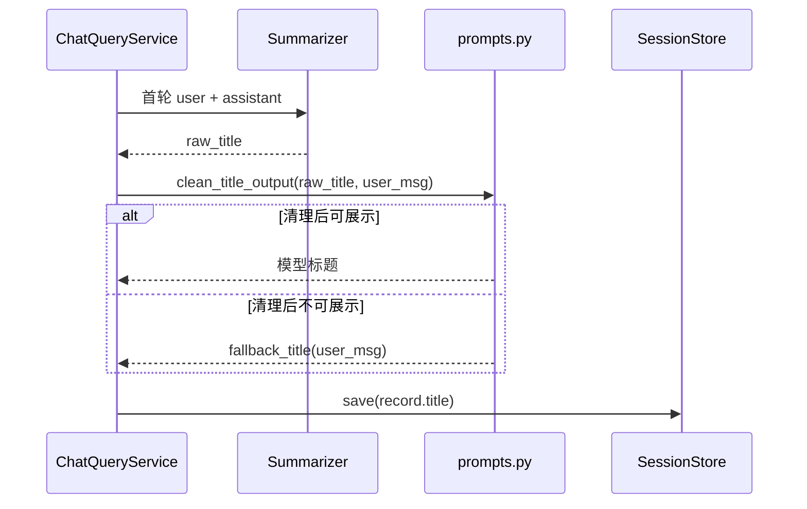

# 会话标题清洗与回退设计说明

**状态**：待评审  
**日期**：2026-06-06  
**仓库**：enviro-nexus-api  
**关联设计**：[`2026-06-03-multi-turn-session-design.md`](2026-06-03-multi-turn-session-design.md)

## 1. 目标

历史会话列表的 `title` 应满足以下优先级：

1. 首选摘要模型根据首轮问答生成的会话标题。
2. 当模型调用失败，或模型返回内容清理后不可用时，回退为首条用户问题截断。

当前实现会把摘要模型原始输出直接 `strip()[:20]` 后存入会话。若模型返回 `<think>` 推理前缀，标题会出现 `<think>\nThe user is` 或 `<think>\n用户询问...` 这类不可展示内容。

本次只修复标题生成结果的清洗与回退，不改变会话 API、存储结构、摘要模型选择或标题生成时机。

## 2. 已确认决策

| 项 | 选择 |
|----|------|
| 处理策略 | 清掉模型输出中的 `<think>` 推理内容后使用正文 |
| 回退条件 | 清理后为空、仍像推理内容、或不是可展示标题 |
| 回退值 | `fallback_title(first_user_message)` |
| 标题长度 | 模型标题继续限制为 20 字 |
| 实现范围 | 新增纯函数清洗标题，`ChatQueryService` 调用该函数 |

## 3. 可选方案

### 3.1 方案 A：清洗模型输出后使用正文（推荐）

新增标题清洗函数，移除 `<think>...</think>`、残留 `<think>` 前缀、首尾引号与常见句末标点。清理后的正文有效时作为标题；无效时回退用户问题截断。

优点：保留模型可用总结，改动小，符合现有设计中的“LLM 生成优先，失败回退截断”。  
缺点：需要维护少量启发式规则。

### 3.2 方案 B：发现 `<think>` 就直接回退

只要模型输出包含 `<think>`，直接使用 `fallback_title`。

优点：规则简单，最不容易泄露推理文本。  
缺点：会丢弃 `<think>...</think>` 后面可能已经正确生成的标题。

### 3.3 方案 C：改为 JSON 结构化标题

调整标题 prompt，要求模型返回 `{"title":"..."}`，解析失败则回退。

优点：长期契约更清晰。  
缺点：改动和测试面更大，不能完全避免模型在 JSON 前输出推理文本；当前问题不需要扩大到 prompt 协议重构。

## 4. 设计

### 4.1 模块职责

| 模块 | 变更 |
|------|------|
| `app/llm/prompts.py` | 新增 `clean_title_output(raw_title, first_user_message)` 纯函数 |
| `app/services/chat_query_service.py` | `_maybe_generate_title` 使用清洗函数，不再直接截断原始模型输出 |
| `tests/test_session_title.py` | 覆盖标题清洗的纯函数行为 |
| `tests/test_chat_query_service.py` | 覆盖真实查询后标题落库行为 |

### 4.2 清洗规则

`clean_title_output(raw_title, first_user_message)` 的处理顺序：

1. 将非字符串模型内容转为字符串，去掉首尾空白。
2. 删除成对的 `<think>...</think>` 内容，大小写不敏感，允许跨行。
3. 若仍存在开头的 `<think>` 或 `</think>` 标签，删除标签及其后的明显推理残留。
4. 将连续空白压缩为单个空格。
5. 去掉首尾常见包装字符：中英文引号、书名号、冒号、破折号。
6. 去掉句末常见标点：句号、问号、感叹号、逗号、分号。
7. 判断清理结果是否可展示。
8. 可展示则返回前 20 字；不可展示则返回 `fallback_title(first_user_message)`。

### 4.3 可展示标题判定

清理结果满足以下任一情况时视为不可展示：

1. 为空。
2. 仍以 `<think` 或 `</think` 开头。
3. 主要内容像模型推理残留，例如以 `The user`、`用户问的是`、`用户询问`、`用户想`、`助手` 这类叙述开头，但没有形成明确标题。

判定应保持保守：只拦截已知坏样例和明显推理残留，不对正常中文标题做复杂语义判断。

### 4.4 数据流



### 4.5 错误处理

- 摘要模型调用异常：沿用现有 `except` 分支，记录 warning，并使用 `fallback_title(user_msg)`。
- 摘要模型调用成功但返回推理残留：不记录异常，清洗函数内部回退。
- 清洗函数不抛业务异常；任何不可用输入都转换为回退标题。

## 5. 测试

| 测试 | 预期 |
|------|------|
| `clean_title_output("<think>分析</think>COD测定咨询", "COD怎么测")` | `COD测定咨询` |
| `clean_title_output("<think>\nThe user is", "COD怎么测")` | `COD怎么测` |
| `clean_title_output("“COD测定咨询。”", "COD怎么测")` | `COD测定咨询` |
| 首轮查询后 summarizer 返回 `<think>...</think>COD测定咨询` | 落库 title 为 `COD测定咨询` |
| 首轮查询后 summarizer 返回 `<think>\nThe user is` | 落库 title 为用户问题截断 |

重点回归：

```powershell
uv run pytest tests/test_session_title.py tests/test_chat_query_service.py -v
```

如时间允许，可跑全量测试：

```powershell
uv run pytest -v
```

## 6. 非目标

1. 不修改历史已保存的异常标题。
2. 不增加会话重命名 API。
3. 不改变标题生成 prompt 的输出协议。
4. 不改变 `preview` 的生成逻辑。
5. 不引入额外 LLM 调用或重试。

## 7. 实施顺序

1. 在 `tests/test_session_title.py` 添加清洗函数单元测试。
2. 在 `tests/test_chat_query_service.py` 添加标题落库集成测试。
3. 在 `app/llm/prompts.py` 实现 `clean_title_output`。
4. 在 `app/services/chat_query_service.py` 调用 `clean_title_output`。
5. 运行重点测试和必要回归。
